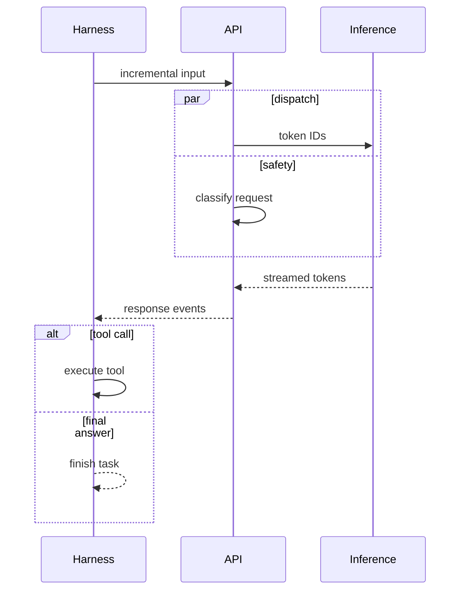

# Mermaid and sequence diagrams

Use Mermaid for semantic diagram types that already have a strong grammar.

## Good uses

- Sequence diagrams with participants, calls, returns, loops, alternatives, and parallel work.
- State diagrams with legal transitions.
- Small acyclic flows where exact placement is not part of the explanation.
- Class and entity-relationship diagrams.

## Sequence template

## Rules

- Declare participants in intended left-to-right order.
- Use `->>` for calls and `-->>` for returns or streamed responses.
- Use `par`, `alt`, `opt`, and `loop` for semantics rather than imitating them with loose arrows.
- Keep message labels short.
- Export to PNG for publication.
- Set sequence-specific theme variables (`actorTextColor`, `signalColor`, `signalTextColor`, `labelTextColor`, and `loopTextColor`); generic `primaryTextColor` does not cover every sequence label.
- Pass an explicit export background color to Mermaid CLI. Do not assume the theme background controls the PNG canvas.

## Switch away from Mermaid when

- The user requests the same layout as a reference image.
- A hub, wheel, token strip, nested panel, or custom callout geometry is required.
- Return paths must occupy a specific gutter.
- The renderer keeps changing node order or connector routes in a way that changes the explanation.
